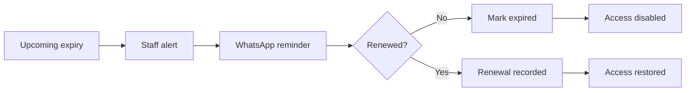

# 792 Fitness Studio — Gym Management System: Master Spec & Roadmap

Sep 23, 2026 · @Someone

Single source of truth for every member, built in phases: the core app and manual data entry start immediately, eSSL access control and WhatsApp automation follow once their external dependencies clear, and the schema is multi-tenant from day one so nothing here has to be rebuilt to scale.

## 1. Architecture & Stack

| Layer | Choice | Why |
| --- | --- | --- |
| Frontend + API | Next.js (App Router) on Vercel | Serverless functions, instant preview deploys, built-in cron |
| Database + Auth | Supabase (Postgres, Auth, RLS, Storage) | RBAC enforced at the database, not just the UI |
| Email | Resend | Staff-facing only: alert digests, receipts, failure notices |
| Member messaging | WhatsApp Business Platform (Cloud API) | See Section 5 |
| Biometric / access | Existing eSSL X2008 / eTimeTrackLite + local Windows connector | Outbound-only HTTPS, no public inbound port |
| Scheduled jobs | Vercel Cron → Supabase functions | Expiry/no-visit alerts, reconciliation, connector health checks |
| Hosting | Vercel (preview + prod) + single Supabase project |  |

Every table carries `gym_id` and Row Level Security from day one, even though the first deployment is one gym. This is what lets the same codebase become a multi-gym product later without a schema migration or rewrite — it costs nothing now and is expensive to retrofit.

## 2. Roles & Permissions

| Role | Access |
| --- | --- |
| Owner / Admin | Full: finance, configuration, users, reports, audit |
| Manager | Everything except finance edits, refunds, and role changes |
| Staff | Members, renewals, attendance, T&C, permitted communications |
| Trainer | Assigned members and PT/session functions only |
| Member (Phase 4+) | Self-service: own profile and history only |

Enforce with Supabase RLS policies keyed on role + `gym_id`, not just conditional UI rendering. A Staff account calling the API directly must be blocked at the database layer.

## 3. Core Data Model

One append-only `member_events` table (not two differently-named event tables) is the permanent timeline; everything else references it.

| Table | Purpose | Phase |
| --- | --- | --- |
| gyms | Tenant record | 1 |
| users / staff | Login + role | 1 |
| members | Master profile | 1 |
| packages | Catalogue | 1 |
| memberships | Current + historical rows, never overwritten | 1 |
| member\_events | Single append-only timeline | 1 |
| membership\_freezes | Freeze periods + approver | 1 |
| payments | Linked to member/membership/PT/product | 1 |
| receipts | Sequential numbering | 1 |
| import\_batches | CSV/eSSL import runs, for audit + safe re-import | 1 |
| terms\_versions / terms\_acceptances | Digital T&C, versioned | 1 |
| gift\_kit\_tasks | Welcome-kit status | 1 |
| attendance | Punch records (manual now, eSSL later) | 2 |
| devices / device\_users | eSSL mapping | 2/3 |
| device\_commands | Access enable/disable log | 3 |
| notification\_rules / notification\_templates | Configurable alert rules | 2 |
| whatsapp\_messages | Message history per member | 3 |
| connector\_heartbeats | eSSL connector health | 2/3 |
| audit\_logs | Who changed what, when | 1 |
| pt\_packages / pt\_sessions | Personal training | 4 |
| expenses / expense\_categories | Running/one-time costs | 4 |
| products / product\_stock / product\_sales | Inventory + sales | 4 |

## 4. Manual Onboarding — Start Now

eSSL and WhatsApp approval both take time; member data entry does not have to wait on either. Two paths, both writing to the same `members`/`memberships` tables so nothing gets re-entered later:

1. **Bulk CSV import** — first Phase 1 screen built. Column-mapping wizard, preview before commit, phone-based dedupe, fuzzy name match shown only as a suggestion, every run logged to `import_batches` so a re-import never creates duplicates.
2. **Manual portal entry** — the real enrollment form staff will use permanently (create member → package → payment → T&C), not a throwaway screen. Building it first means it never has to be built twice.

Staff can start loading the current member spreadsheet the moment these two screens exist, in parallel with the rest of Phase 1.

## 5. WhatsApp Approach

**Decision: official WhatsApp Cloud API, on a new dedicated number — not automation on a personal or Business-app account.** A regular WhatsApp account has no API to call; unofficial QR-session tools (Unipile, whatsapp-web.js, Baileys) work but violate WhatsApp's terms, carry an unappealable ban risk, and are unsuitable for comms tied to access control.

Setup sequence:

1. Register a new number that has never been active on regular WhatsApp or the consumer Business app.
2. Create a Meta Business Portfolio and WhatsApp Business Account (WABA) via Embedded Signup.
3. Start sending immediately, unverified — capped at 250 business-initiated conversations per rolling 24 hours, enough for one gym's MVP and early production.
4. Submit GST/incorporation documents for full Business Verification when volume needs it, to remove the cap. Should be fast since the LLP is already incorporated.
5. Get templates approved: enrollment confirmation, renewal reminder, expiry reminder, generic gym message.
6. Build it as an isolated module (`whatsapp_messages` table + a provider adapter) so switching providers later never touches core logic.

## 6. Phased Roadmap

| Phase | Scope | Exit Criteria | Blocked By |
| --- | --- | --- | --- |
| 0 — eSSL Spike | Test the real installation: read logs, create/update/block/delete user, push vs. polling, offline behavior | Written capability table + chosen fallback | Access to the gym PC |
| 1 — Core (build now) | Auth/RBAC, members, packages, memberships, payments, T&C, timeline, CSV import, portal entry, dashboard skeleton | Real member list imports with zero duplicates on re-import; enrollment flow works end-to-end | None |
| 2 — Attendance & Alerts | Local connector, punch sync (or manual-entry fallback), expiry/no-visit alerts, live dashboard | Attendance appears in the timeline within minutes; alerts fire on schedule | Phase 0 result, Phase 1 |
| 3 — Access Control & WhatsApp | Auto enable/disable at the door, WhatsApp confirmations and reminders | Expired member blocked at the door; failures visible and retried; first automated message sent | Phase 0 result, Meta approval |
| 4 — Extras | PT, expenses, products, notification-rules engine, advanced analytics, member self-service | Each ships independently, no changes to core | Phases 1–3 stable |
| 5 — Future / AI | AI-powered WhatsApp CRM, churn/no-show prediction, smart PT recommendations | Scoped once core data has been trustworthy for months | Phase 4 |

Confirmed 23 Sep: Phase 0 being blocked on gym-PC access does not block Phase 1 — start the core build now, in parallel.

## 7. Key Workflows

One connected chain per enrollment — one update should be able to trigger every downstream step.

A failed disable/restore command raises an operational alert rather than failing silently.

## 8. Non-Functional Requirements

- **Backups** — daily automated Supabase backups, plus a monthly tested restore (not just a scheduled job that's assumed to work).
- **Multi-tenancy** — `gym_id` + RLS on every table from Phase 1, so a second gym is a config, not a migration.
- **Privacy** — biometric data minimized; medical/injury notes access-restricted; DPDP Act-aligned consent, retention, and deletion policy.
- **Security** — Supabase Auth + RLS, encrypted transport, secrets outside source control, audit logging on every sensitive change.
- **Observability** — connector health monitoring; alert on sync or access-command failures, not silent drops.
- **Fail-safe** — if a disable/enable command fails, the member's state stays unchanged, an alert fires, and a daily reconciliation job compares device users against the database.

## 9. Open Decisions Needing Owner Sign-off

| Decision | Recommended Default |
| --- | --- |
| Multiple simultaneous memberships? | No — one active membership per member |
| Renewal timing before expiry | Confirmed: pay/renew any time before expiry, but the new period starts after the current one ends (no overlap) |
| Backdated freeze | Not allowed |
| Freeze approval | Manager or Admin only |
| Grace period after expiry | 0–3 days, configurable |
| Manager's exact permissions | Everything except finance edits, refunds, role changes |
| GST/tax fields | Included from Phase 1 |
| Multi-tenant schema | Build multi-tenant now, deploy single-gym |

These gate the schema — resolve before Phase 1 design, not during it.

## 10. Future "Wow" Additions (Phase 5+)

- Member self-service: own timeline, PT booking, freeze requests
- Predictive churn alerts — flag declining visit frequency before it becomes a no-visit alert
- AI WhatsApp concierge for renewals/FAQs, once core data is trustworthy
- Staff performance dashboard — renewals closed, gift kits delivered on time
- Referral tracking tied to actual conversion, not just a source field
- QR-code check-in as a fallback for days the biometric system is down
